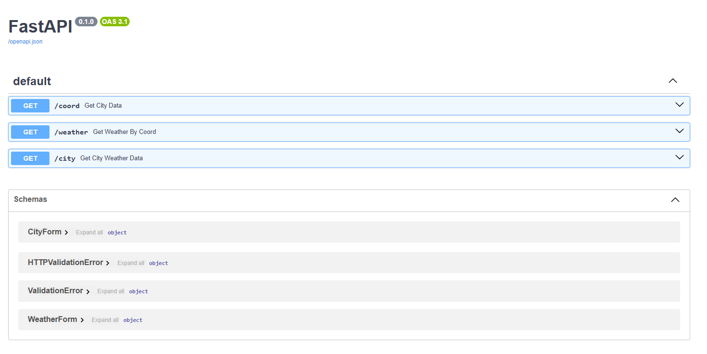
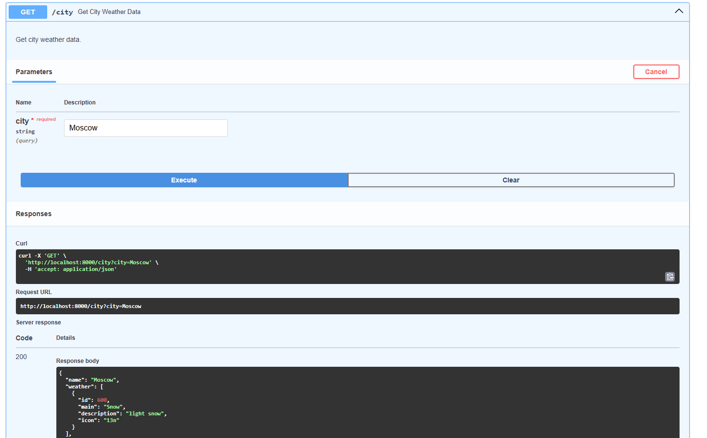
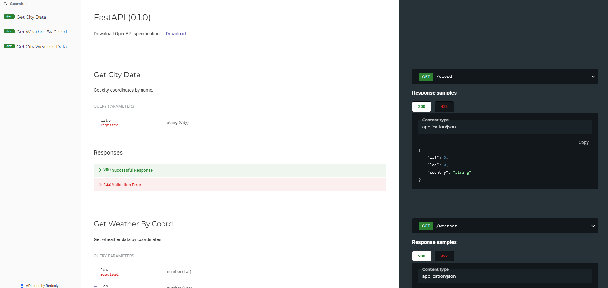
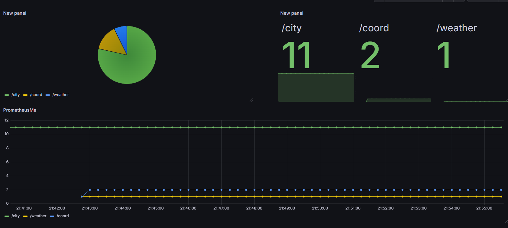
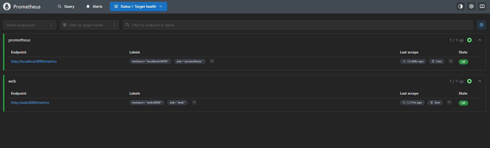
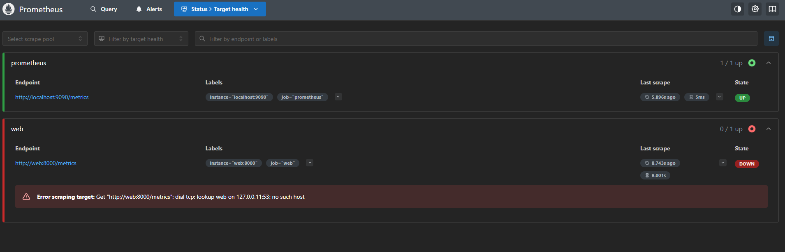

# TestRBS-
Тестовое задание ООО РУНЕТ БИЗНЕС СИСТЕМЫ на вакансию IT engineer (Стажер)


# ТЗ 

1. Создать лёгкое веб-приложение (например, на Python, Node.js, Go, Java или любом другом языке), которое отображает текущую температуру
2. Упаковать приложение в Docker-контейнер.
3. Настроить мониторинг доступности погодного веб-приложения (HTTP-check)
# 

.env файл содержит токен для работы с `OpenWeather`, .env не внесен в .gitignore для удобства.

#   APP 

Реализовано три эндпоинта на `FastAPI`.

`Prometheus` для сбора метрик. 

`Grafana` для визуализации. 

## FastAPI API 
`/coord` - координаты города.
    
* `city`: `str`

`/weather` - погода по координатам. 
* `lat`: `float`
* `lon`: `float`

`/city` - погода в городе.
* `city`: `str`

использовалось API openweather 'https://docs.openweather.co.uk/'


## Структура проекта

```

-- /src 
    -- /app
       -- /servicess 
            api.py // реализован класс WheatherApi 
                      с двумя эндпоинтами api - координаты, погода   

          main.py     // реализует эндпоинты
          config.py   // реализует класс Setting с параметрами из .env файла
    .env           // секретные файлы / константы (Url api)
    requirements.txt // зависимости 
```


## Start

```bash
cd app
```

Создание виртуального окружения.
```bash
python3 -m venv venv
```
Активация виртуального окружения.

```bash
source venv/bin/activate
```

Установка зависимостей.
```bash
pip install -r requirements.txt
```

Запуск сервера.
```bash
uvicorn main:app --reload --host 0.0.0.0 --port 8000 
```

## Запуск Docker

* app
* prometheus
* grafana

находясь в `src`
```
docker-compose up -d 
```


## Docs

#### http://localhost:8000/docs






#### http://localhost:8000/redoc




# Grafana DashBoar
### http://localhost:3000/


# Prometheus HealthChek 

### http://localhost:9090/targets



